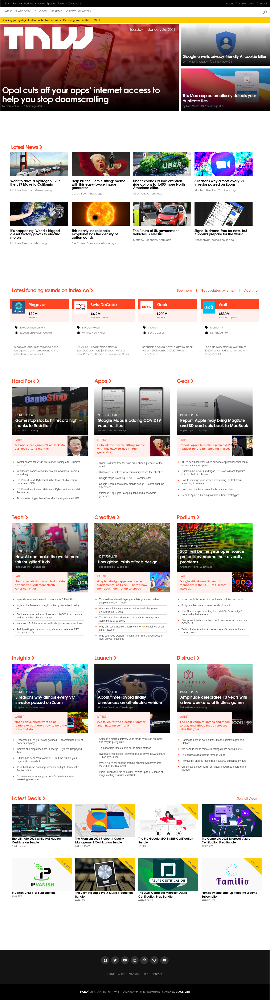

# TNW Clone

> This is week two project for Microverse software development programme.

This week's project technical skills are:
* Ability to create UIs adaptable to different screen sizes using mediaqueries
* Apply front-end best practices
* Create UIs adjusted to given designs
* Understand the usefulness of CSS preprocessors

## Built With

- HTML5
- CSS3

## Live Demo

[Live Demo Link](https://livedemo.com)

## Authors

👤 **Junior Fondem**

- GitHub: [@Fondem-Jr](https://github.com/Fondem-Jr/)
- Twitter: [@OpportunistZeus](https://twitter.com/OpportunistZeus)
- LinkedIn: [LinkedIn](https://www.linkedin.com/in/fondem-junior-57484744)

👤 **Ênio Neves de Souza**

- GitHub: [@enionsouza](https://github.com/enionsouza/)
- Twitter: [@enionsouza](https://twitter.com/enionsouza)
- LinkedIn: [LinkedIn](https://www.linkedin.com/in/enio-neves-de-souza/)

## 🤝 Contributing

Contributions, issues, and feature requests are welcome!

## Show your support

Give a ⭐️ if you like this project

## 📝 License

This project is [MIT](./MIT.md) licensed.